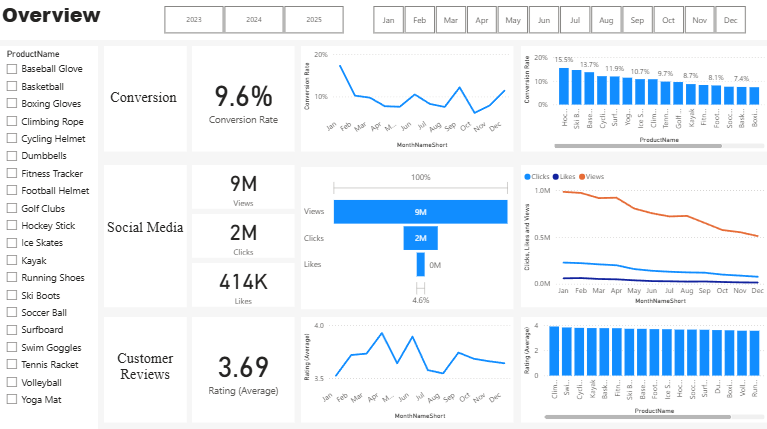
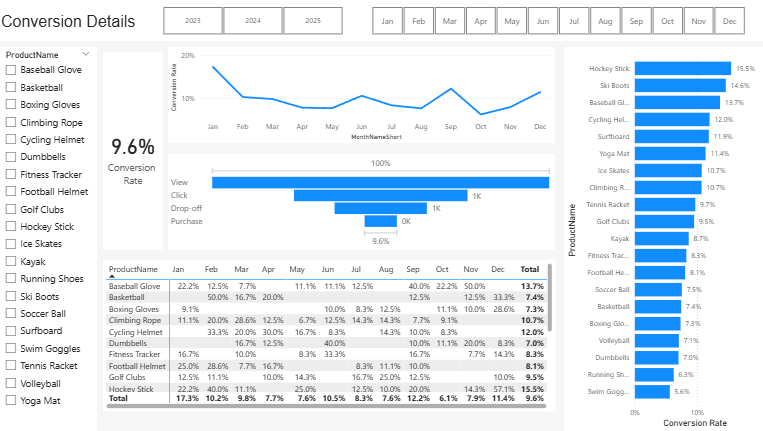
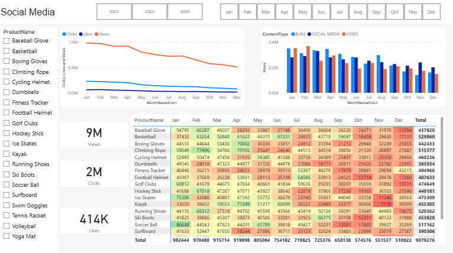
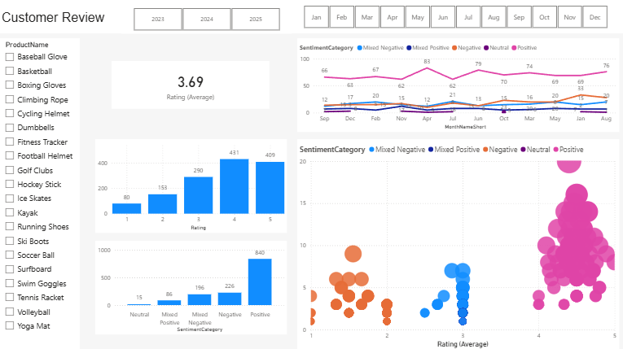

# ShopEasy: Customer Engagement & Sentiment Analysis

## 1. Title  
**ShopEasy – Customer Engagement, Conversion Analysis & Sentiment Insights**

---

## 2. Executive Summary  
ShopEasy, an online retail company, is experiencing declining customer engagement and lower conversion rates despite increased marketing investments.  

This project combines **SQL, Power BI, and Python (NLP)** to analyze customer behavior, engagement metrics, and sentiment, providing actionable insights to improve business performance.

---

## 3. Business Problem  

- Declining engagement  
- Lower conversion rates  
- High marketing costs with low ROI  
- Lack of customer feedback analysis  

---

## 4. Methodology  

### 🔹 SQL Data Preparation  
- Data extraction from multiple tables (customers, geography, engagement, reviews, customer journey)  
- Data cleaning and transformation (handling missing values, duplicates, and formatting issues)  
- Feature engineering (Views, Clicks, Price Categories, standardized text fields)  

### 🔹 Python (NLP)  
- Sentiment analysis using VADER  
- Processed **1,363 customer reviews**  
- Generated:
  - SentimentScore  
  - SentimentCategory  
  - SentimentBucket  

### 🔹 Power BI  
- Star schema data model:
  - `dim_products`
  - `fact_engagement_data`
  - `fact_customer_journey`
  - `calendar`
- Interactive dashboards with filters by:
  - Product
  - Time (Month/Year)
  - Campaign  

---

## 5. Power BI Dashboard  

### 📊 Overview  

**Analysis:**
- Overall conversion rate is **9.6%**, indicating that a large portion of users do not complete purchases  
- High volume of **views (9M)** compared to **clicks (2M)** suggests weak engagement in the funnel  
- Engagement trends show a **decline over time**, pointing to reduced campaign effectiveness  
- Some products receive high traffic but do not translate into conversions  

### 📈 Conversion Analysis  

**Analysis:**
- There is a **significant drop-off** between the “View” and “Purchase” stages  
- Certain products consistently outperform others, indicating **strong product-market fit**  
- Conversion rates fluctuate by month, suggesting **seasonality effects**  
- Funnel inefficiencies highlight opportunities to optimize the customer journey 

### 📱 Social Media Performance  

**Analysis:**
- Social media generates high visibility but **low interaction (clicks)**  
- The gap between views and clicks indicates **low content effectiveness or targeting issues**  
- Engagement has been **declining steadily**, suggesting audience fatigue or poor campaign optimization  
- Content type plays a key role in performance and should be optimized 

### 🗣️ Customer Sentiment  

**Analysis:**
- Average rating is **3.69**, indicating moderate customer satisfaction  
- Majority of reviews are positive, but **mixed and negative sentiment is still significant**  
- Negative sentiment is often related to **pricing and perceived value**  
- Products with lower sentiment scores tend to align with **lower conversion rates**, showing a clear relationship between sentiment and purchasing behavior  

---

## 6. Data Preparation Summary  

- Joined customer and geography data to enrich customer profiles  
- Cleaned and standardized customer reviews text data  
- Categorized products based on pricing strategy (Low, Medium, High)  
- Transformed engagement data into structured metrics (Views, Clicks, Likes)  
- Removed duplicate records and handled missing values in customer journey data  

---

## 7. Skills Demonstrated  

- SQL (data extraction, cleaning, transformations)  
- Power BI (data modeling, DAX, dashboards)  
- Python (pandas, NLP, sentiment analysis with VADER)  
- Data Modeling (Star Schema)  
- Data Cleaning & Feature Engineering  
- Business Analytics & KPI Development  

---

## 8. Results & Business Recommendations  

### Key Findings

- High traffic but low conversion rates → funnel inefficiency  
- Engagement declining over time  
- Significant variation in product performance  
- Customer sentiment impacts purchasing decisions  
- Marketing efforts not aligned with high-performing products  

---

### Business Recommendations

- Focus marketing efforts on high-converting products  
- Optimize low-performing product pages (pricing, UX, descriptions)  
- Address negative customer feedback (quality, expectations, delivery)  
- Reallocate budget to high-ROI campaigns  
- Implement continuous sentiment monitoring  

---

## 9. Next Steps  

- Build customer segmentation models  
- Develop predictive models for conversion rates  
- Implement real-time dashboards  
- Conduct A/B testing  
- Automate NLP sentiment pipeline  

---

## Tools Used  

- SQL Server  
- Power BI  
- Python (pandas, nltk, VADER)  

---

## Project Outcome  

This project demonstrates how combining **data engineering, business intelligence, and NLP** can generate actionable insights to improve customer engagement, optimize marketing strategies, and increase conversion rates.
